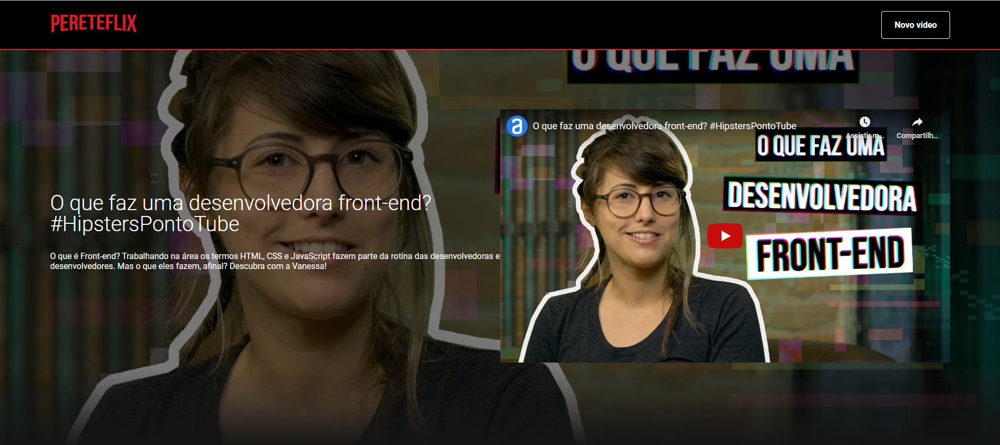

<h1 align='center'>#ImersaoReact - Alura</h1>

    
    
    

_________

## 🔖 Descrição 

Criação do PereteFlix 🎥 

Vídeos sobre: séries, filmes, jogos, estudos, etc.

Um App Web utilizando React na semana da #ImersãoReact da [Alura][alura] 💜.

_________

## 🚀 Como executar o projeto

    # Clone esse repositório
    $ git clone https://github.com/philipeperete/PereteFlix
    
    # Instalar dependências
    $ npm install  
    
    # Executar
    $ npm start

_________

## 🎨 Layout

	 

     
    
    
    

_________

## 📝 Licença

O projeto se encontra sob licença MIT.

Para mais detalhes, acesse [license](LICENSE).

_________

Agradecimentos [Alura][alura] 💜.

* Twitter: [Philipe Perete](https://twitter.com/PhilipePerete).
* Linkedin: [Philipe Perete](https://www.linkedin.com/in/philipe-perete-b76622104).
* Github: [Philipe Perete](https://github.com/philipeperete).

Feito com 💙 por **Philipe Perete** 👻.

[alura]: https://www.alura.com.br/